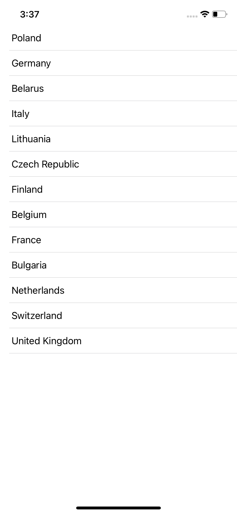

# EmptyList

[](https://swift.org/)
[](https://cocoapods.org/pods/EmptyList)
[](https://cocoapods.org/pods/EmptyList)
[](https://opensource.org/licenses/MIT)

EmptyList - List(SwiftUI) supports displaying Empty ListView for empty state

## Example

```swift
EmptyList(countries, listRowView: { country in
    Text(country.name)
}, emptyListView: {
    Text("No countries") // View displayed when the items collection isEmpty
})

// Source data for List. Source item must implement Identifiable protocol
struct Country: Identifiable {
    let id: UUID
    let name: String
}

// Source data items for List 
let countries: [Country] = [
    Country(id: UUID(), name: "Poland"),
    Country(id: UUID(), name: "Germany")
    /// Others countries 
]
```
<div style="display: flex">
    <div align="center"></div>
    <div align="center"></div>
</div>
// TODO Add example link

## Requirements

Xcode 11+
Swift 5.2+

And same requirements how to use [SwiftUI](https://developer.apple.com/documentation/swiftui). Availability:
- iOS 13.0+
- macOS 10.15+
- Mac Catalyst 13.0+
- tvOS 13.0+
- watchOS 6.0+

## Installation

Feel free copy-paste ```EmptyList``` to your project or can install via [CocoaPods](https://cocoapods.org).
For installation through [CocoaPods](https://cocoapods.org) add the following line to your Podfile:

```ruby
pod 'EmptyList', '~> 1.0.0'
```

## License

EmptyList is available under the MIT license. See the LICENSE file for more info.
